 # Book Worm Quiz

 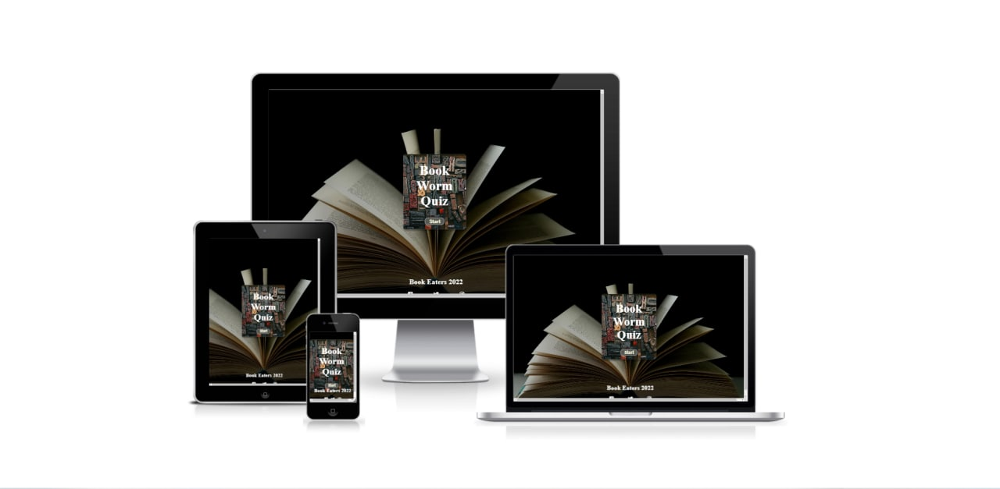

 ## Purpose of the Project

 [Link to Live Site Here](https://bogdanfsd.github.io/Book-Worm/)

 Main idea was to create an webpage with interactivity using HTML, CSS, JavaScript. For this reason I picked up a topic of books. Idea of quiz straightforward to check how familiar user are with the stories of the most popular books like Harry Potter, Lord of the rings, The Great Gatsby etc.

 My questions are created by myself and will be based on the rating of the most popular/famous books either classical or moerdn one. I  picked them up    [here](https://thegreatestbooks.org/) first 10 books from the list. Fortunately I read them as well as I am kind of Book Worm. Question would be easy and covered just main line and main story of the book so even if visitor read those books loooong time ago he/she would be able to answer them.

 User will choose  one answer from 3 available options that they believe is true. After the Quiz user can see the score of how well or bad they did, with time they took to finish the quiz. Once result presented user can decide to try it one more time or leave the page. 
 Link to [live site](https://bogdanfsd.github.io/Second-project/)

# **Contents**

* [**UX (User Experience)**](<#user-ecperience-ux>)
  * [**Vision**](<#vision>)
  * [**Aims**](<#aims>)
  * [**Audience**](<#audience>)
  * [**User Stories**](<#user-stories>)
* [**Design**](<#design>)
  * [**Fonts**](<#fonts>)
  * [**Colors**](<#colors>)
  * [**Images**](<#images>)
  * [**Structure**](<#structure>)
* [**Features**](<#features>)
  * [**Future Features**](<#future-features>)
* [**Technologies**](<#technologies>)
  * [**Tools**](<#tools>)
  * [**Languages**](<#languages>)
* [**Testing**](<#testing>)
  * [**Code Validation**](<#code-validation>)
  * [**Deployment**](<#deployment>)
*[**Credits**](<#credits>)

## **UX (User Experience)**

### **Vision**

Book Worm Quiz this is easy quiz to check the knowledge of people who called themself bookworms. Quiz will ran through very famous books and will ask iser only the most famous and important parts of the story so there is no need to remember the color socks that Romeo wear while was climbind to Juliet. Although  this can give an idea if person want to re-read something again or if we are talkinf about bookworm-beginner so they can find just another good quality book to spent time with.

### **Aims**

Provide a small interactive game where reader test their memory at some great readings thet probably might read long time ago. Hope it will make some feeling when you just remember something very good that happened with you long time ago (memories from childhood etc) that pops up to your mind and you want to repeat that again. Should be easy and fun so people can re-play to upgrade their score and time about topic.

### **Audience**

Books are beyond any age and values that people might have in their mind so this quiz is for everybody who consider himself/herself as bookworm and want to test himself a bit.

[Back to menu](#contents)

### **User Stories**

- Visiting site for first time would like to find:
    - As a first time Visitor, I want to understand easly the main purpose of the game and the rules.
    - As a first time Visitor, I want quiz be relax and slightly challenging.
    - As a first time Visitor, I want to know my result once finished questions.
    - As a first time Visitor, I want to be able to re-play the quiz.
   

- Returning visitor to the site:
    - As a returning  Visitor, I want to play at any device

    

###  **Owner Goals**

- As owner I want user join the community.
- As owner I want user be able to contact our community through contact form.
- As owner I want to show that crypto is interestin, fun and lifechanging.

[Back to menu](#contents)

##  **Design**

###  **Fonts**

I stopped my choice at [Goudy Bookletter 1911](https://fonts.google.com/specimen/Goudy+Bookletter+1911?query=goudy) both for questions and answers as I really love oldschool typography and this font remind me that. As well it suits Book Worm Quiz perfectly as what could be better for bookworm than pleasent font. Please see an example:

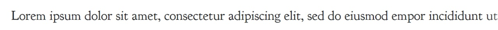

[Back to menu](#contents)

###  **Colors**

This quiz all way long in a bit dark colors just what readers would like to have so nothing distract you (like very bright color). Each color complement each other. Black and White been first colors at my mind as we are readers seeing big part of our live in this colors. Artichoke reminds the color of the paper and Caput Mortuum just calm and relaxing color that match previous colors

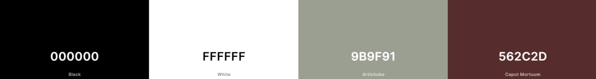

[Back to menu](#contents)

### **Images**

All images I took from [Unsplash](https://unsplash.com/). Found background of openned book and letters in the midle complement the quiz and each other. As well creates great atmosphere that you can have only with opened book in your hand.

[Back to menu](#contents)

### **Scope**

I found best approach for creating this quiz in waterfall. Which means that I would create each element and section and check them straight away to make sure that everything linked and work correctly before going to the next section. As long as User progress though the sections the one he completed will be hidden and new one displayed. I believe this approach will help me to finish project on time and tested everything.

[Back to menu](#contents)

### **Structure**

This is 1 page quiz. I found two pages the easiest for me to progress throught the development of the quiz. At index.html I was more focused on design of welcome page and location of the elements while game-rules.html have the same style but here I spend my time on developing the structure of HTML for quiz and logic. I want to make multipl number of divs that will pops up and hide while user progress clicking on the buttons.

Everything starts from landing page where User can find the name of the Quiz and button "Start" after clicking on which it directs you to the rules where User can read and understand main rules of the quiz and another button "Play" cliking on which leads you to a quiz by itself. In the end of question will be shown sentece that User finish the quiz and if he wants he can start again. Everytime user progress to new divisions previous one will be hidden.

[Back to menu](#contents)

## **Features**

### Landing page

 * First thing User will is the container in the middle with the name of the quiz and a "Start" button. Once user clicks it the container with tha name dissapaer and another box with set of rules pops-up:

    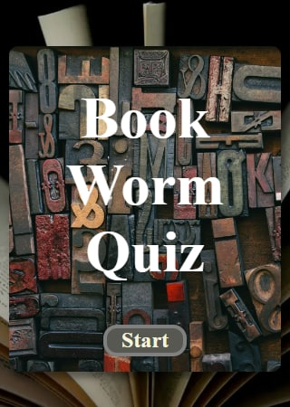

### Rules Box

 * An box appear with set of rules and with button to keep going to play the quiz:

    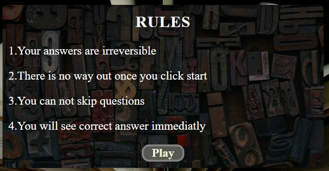

### Quiz 

 * Quiz consist from Questoin by itself at the upper part of the container. Under the question we can see 4 buttons which are clickable as we need to pick up an answer.
 * once the User decide what he want and he is correct. Than button that is correct change the color to green and all wrong question turning to sort of brown color so user will always see correct answer.
 * Since User make his choice and saw the correct answer, if he mistaken, than button ""Nextt"" pops up  under the answers

 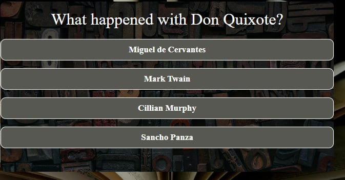
 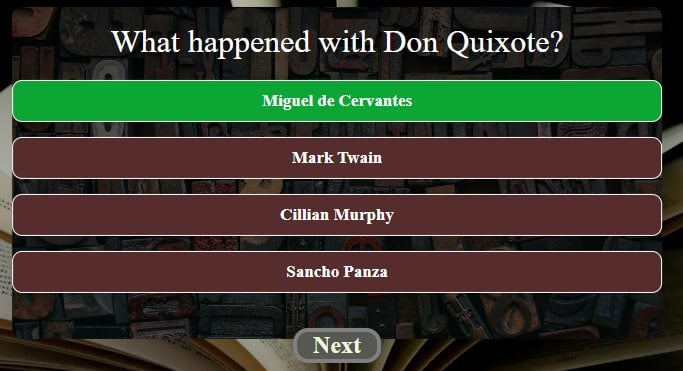

 ### End page

 * Final and simple container that tells you that Quiz is finished and you can start to play again if you want so.

 #### **Future features**

 I would like to add some features later on the the project:
 
 * Want to make sure person can or log in.

 * Displaying the score so people can have some challenge

 * Increase ammout of questions so user would be more interested 

 [Back to menu](#contents)

### **Tools**

+ [Gitpod](https://www.gitpod.io/) - IDE and just comfortable enviroment of coding, and sharing.
+ [GitHub](https://github.com/)-  deploying the project.
+ [Goodle Fonts](https://fonts.google.com/) - choosing and matching fonts.
+ [Favicons](https://favicon.io/) - generating icon for something
+ [Lighthouse](https://developers.google.com/web/tools/lighthouse) - checking responsivity of the site.
+ [Unsplash](https://unsplash.com/) - source of image.
+ [Coolors](https://coolors.co) - source of colors for design

[Back to menu](#contents)

## **Technologies**

### **Languages**

* [HTML5](https://en.wikipedia.org/wiki/HTML5)
* [CSS3](https://en.wikipedia.org/wiki/CSS)
* [JavaScript](https://en.wikipedia.org/wiki/JavaScript)

[Back to menu](#contents)

## **Testing**

### **Code Validation**

### **HTLM Validation**

The HTML was validated [W3C Markup Validation Service](https://validator.w3.org/) I got one mispelling of "classs" as soon as I changed that no problems.

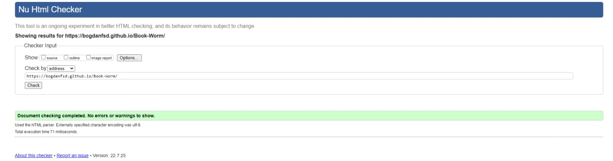

### **CSS Validation**

The CSS was walidated [W3C CSS Validation Service](https://jigsaw.w3.org/css-validator/validator). I got an erro as I didn't linked correctly stylesheets to HTML.index file. No problems in general

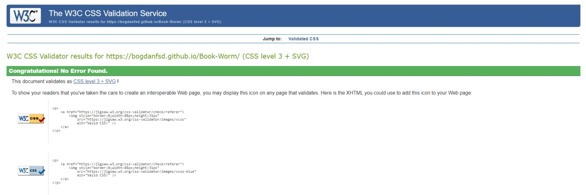

### **JavaScript Validation**

Document been validated by [JSHint](https://jshint.com/) and received missing semicolon and that's was it. To avoid some warnings from JSHint I used following

- /* jshint esversion: 8 */ for the ES6 to accept const and other features 

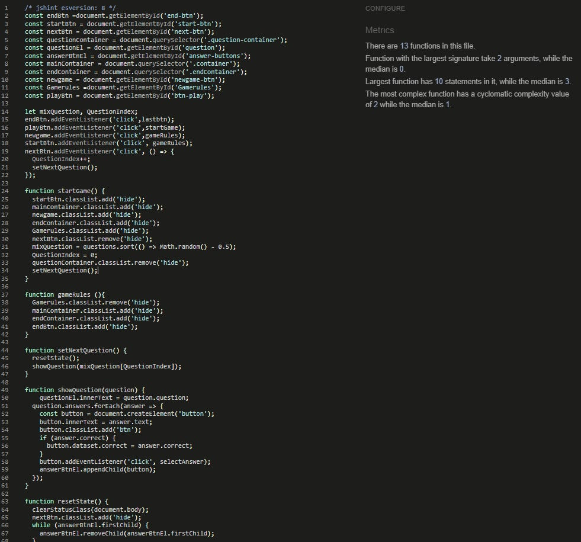

### **Perfomance and Accessibility Testing**

With the help of Lighthouse from Chrome Development tool I made an inspectin. Background images been converted to .webp using [cloud convert](https://cloudconvert.com/)

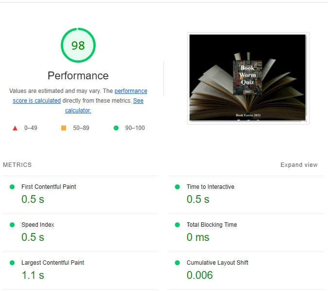

[Back to menu](#contents)

### **Deployment**

* Inside Github find repositories, and click on Book-Worm
* Next click on Settings
* On left-hand side locate Pages and click on it
* in drop-menu select Main Branch
* Once selected Main Branch the webpage will refresh and provide you a link of deployed project
* Site will locate [here](https://bogdanfsd.github.io/Book-Worm/)

[Back to menu](#contents)

## **Credits**

This Milestone was super challenging for me and sometimes I was checking websites like w3School in order to find what I don't understant. Video of one particular guy helped me a lot but nothing was copy paste from there [James Q Quick](https://www.youtube.com/watch?v=u98ROZjBWy8&list=PLDlWc9AfQBfZIkdVaOQXi1tizJeNJipEx&ab_channel=JamesQQuick) as well some tings become more understandable after [Web Dev Simplified](https://www.youtube.com/watch?v=riDzcEQbX6k&ab_channel=WebDevSimplified).
